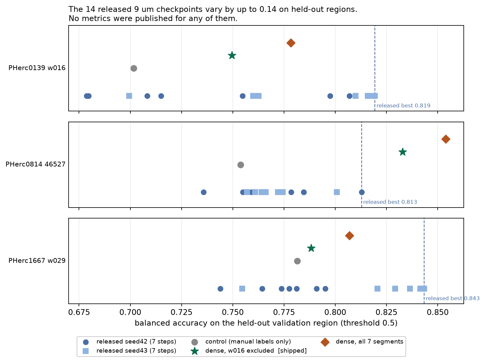
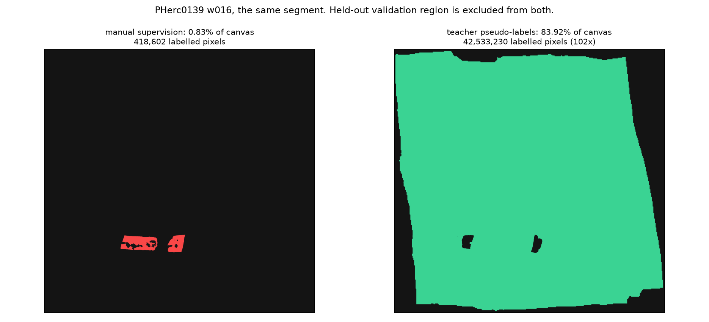
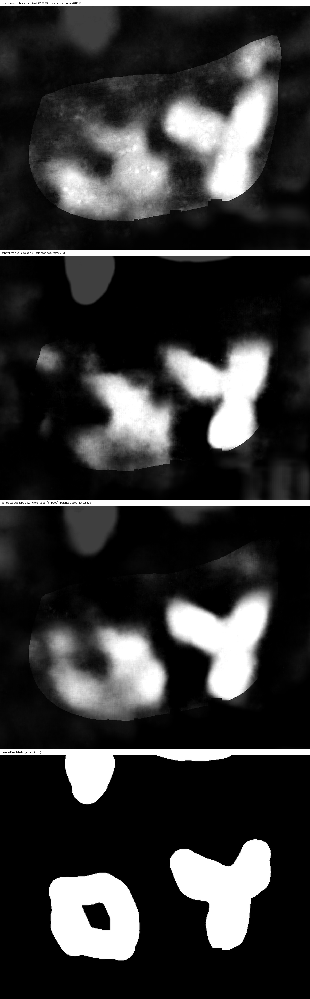
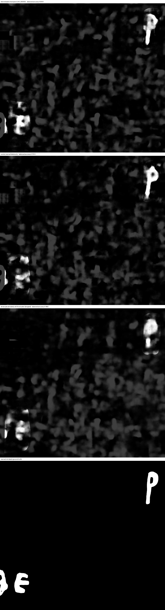
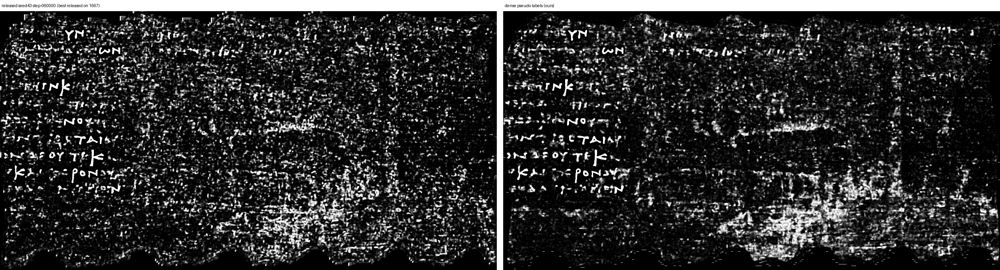
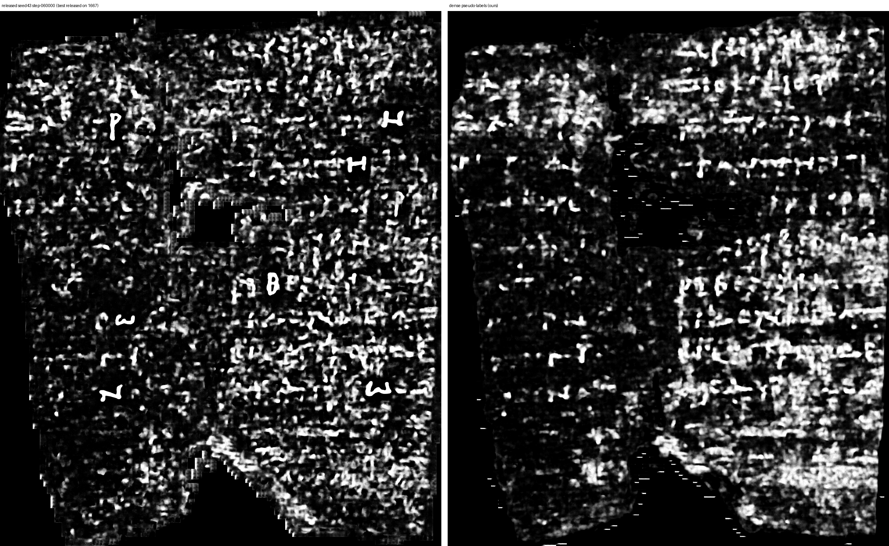
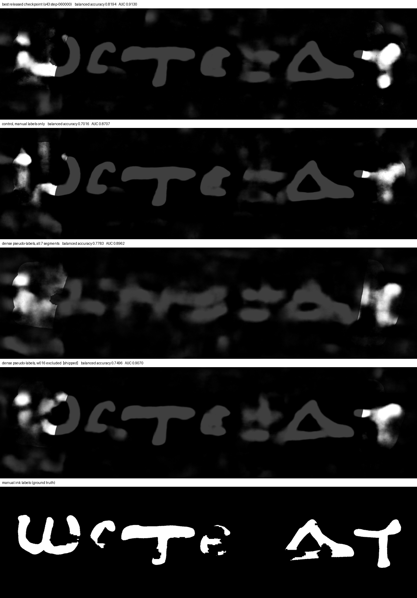
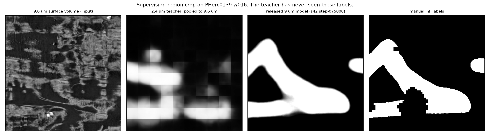
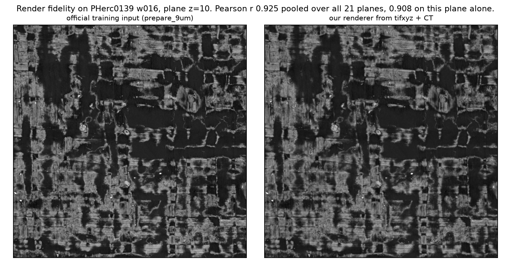

# Measuring and improving the released 9 um ink models

Three things are in this repo, in descending order of how useful I think they are:

1. **The first per-region evaluation of all 14 released 9 um ink checkpoints**, plus the harness that produced it. No performance metrics were published with those weights, and it turns out the choice of checkpoint moves held-out balanced accuracy by up to 0.14. If you are picking a 9 um ink checkpoint for a First Letters attempt, this tells you which one to pick.
2. **A dense pseudo-label dataset** for 7 aligned segments, 288.7 M supervised pixels against the team's 5.8 M, and the checkpoints trained on it. Trained against a matched control, dense supervision improves held-out balanced accuracy on all three validation regions and collapses the supervised-to-held-out gap from about 0.25 to about 0.06.
3. **A demonstration that balanced accuracy at threshold 0.5 can prefer a visually worse ink map.** Two models differing only in one segment's labels, where the metric ranks the smeared output above the legible one. This is a concrete instance of something the team has said it suspects about its own metrics.

Everything here comes from public data. All numbers are measured with the team's own `BalancedAccuracy` metric on the team's own validation masks, using their inference contract.

---

## 1. What the released checkpoints actually score



The `ink_9um` release contains 14 checkpoints, 2 seeds by 7 step counts, and no metrics. The three `_validation_mask.zarr` regions that ship with the labels are the only held-out ground truth in the release, so they are the only honest place to measure. Full table, balanced accuracy at threshold 0.5 / AUC, on the validation region of each segment:

| checkpoint | pherc0139-w016 | pherc0814-46527 | pherc1667-w029 |
|---|---|---|---|
| seed42 step-010000 | 0.7974 / 0.8919 | **0.8129** / 0.8847 | 0.7438 / 0.8443 |
| seed42 step-020000 | 0.8069 / 0.9135 | 0.7846 / 0.8787 | 0.7909 / 0.8833 |
| seed42 step-030000 | 0.7082 / 0.8170 | 0.7357 / 0.8684 | 0.7951 / 0.9172 |
| seed42 step-040000 | 0.7548 / 0.8158 | 0.7785 / 0.8652 | 0.7738 / 0.8823 |
| seed42 step-050000 | 0.6787 / 0.8091 | 0.7549 / 0.8970 | 0.7811 / 0.8898 |
| seed42 step-060000 | 0.7150 / 0.8087 | 0.7846 / 0.8711 | 0.7775 / 0.8952 |
| seed42 step-075000 | 0.6796 / 0.7709 | 0.7592 / 0.8749 | 0.7644 / 0.8702 |
| seed43 step-010000 | 0.6994 / 0.8717 | 0.8008 / 0.8585 | 0.7545 / 0.8507 |
| seed43 step-020000 | 0.7627 / 0.9247 | 0.7609 / 0.8330 | 0.8205 / 0.9198 |
| seed43 step-030000 | 0.7599 / 0.8807 | 0.7744 / 0.8459 | 0.8292 / 0.9334 |
| seed43 step-040000 | 0.8159 / 0.9144 | 0.7570 / 0.8589 | 0.8425 / 0.9187 |
| seed43 step-050000 | 0.8165 / 0.9125 | 0.7661 / 0.8637 | 0.8414 / 0.9218 |
| seed43 step-060000 | **0.8194** / 0.9130 | 0.7641 / 0.8578 | **0.8434** / 0.9180 |
| seed43 step-075000 | 0.8099 / **0.9366** | 0.7721 / 0.8628 | 0.8365 / 0.9298 |

Three things fall out of this:

**The spread is large.** 0.1407 on w016, 0.0771 on 0814, 0.0996 on w029. That is bigger than most improvements anyone is likely to claim on this task, so any comparison against "the released model" needs to say which one.

**seed43 is systematically better on two of three regions.** On w016 and w029 the seed43 checkpoints occupy the top of the range almost exclusively. Same-step seed differences reach 0.130 on w016. If you are choosing blind, seed43 later steps are the better default.

**The most obvious default is close to the worst choice.** `seed42/step-075000` is the final checkpoint of the first seed and the natural thing to reach for. It ranks last of 14 on w016 (0.6796 against 0.8194 for the best) and near the bottom on w029.

Reproduce with `scripts/step9_eval.py --released`. It runs the team's inference CLI at their documented settings (`--overlap 0.5 --blend-mode hann --batch-size 8`), scores with their `BalancedAccuracy` against both the supervision and validation masks, and adds a rank-based AUC.

---

## 2. Dense pseudo-labels, and what they do

Manual supervision covers 1 to 6 percent of each segment's canvas. The released model scores about 0.99 inside that supervision and 0.68 to 0.78 outside it, so almost all of its apparent accuracy is on pixels it was trained on.

To densify supervision without new annotation, the canonical 2.4 um ink model is run on each segment's public 2.4 um surface volume and pooled to the exact 9.6 um raster the 9 um model trains on. Its output is thresholded per segment at a value calibrated only on that segment's supervision region, and manual labels win wherever manual supervision exists. Validation regions are excluded from the pseudo supervision entirely.



| segment | manual px | pseudo px | multiplier | canvas covered |
|---|---|---|---|---|
| pherc0139-w016 | 418,602 | 42,533,230 | 101.6x | 83.9% |
| pherc0139-w017 | 719,008 | 42,835,355 | 59.6x | 85.0% |
| pherc0139-w028 | 1,756,535 | 41,464,705 | 23.6x | 88.8% |
| pherc0139-w029 | 394,114 | 41,188,859 | 104.5x | 88.2% |
| pherc0814-46527 | 428,993 | 4,175,514 | 9.7x | 56.7% |
| pherc1667-w028 | 844,780 | 58,012,015 | 68.7x | 81.8% |
| pherc1667-w029 | 1,212,915 | 58,508,474 | 48.2x | 78.7% |
| **total** | **5,774,947** | **288,718,152** | **50.0x** | **83.2%** |

The dataset is in `pseudo_labels/`, in the same layout and zarr parameters as the team's own label release, so it drops into a training config by changing one path.

### The ablation

Three runs, each 78,125 iterations at batch 64, seed 42, on the full 29-representation corpus. They are identical except for which label root 7 of the 29 segments read from. Configs are in `configs/`, and a diff of the three shows only `out_dir` and those 7 `segments_path` values changing.

| model | w016 | 0814 | w029 |
|---|---|---|---|
| control, manual labels only | 0.7016 / 0.8707 | 0.7539 / 0.8323 | 0.7814 / 0.8945 |
| dense, all 7 segments | 0.7783 / 0.8962 | **0.8539** / **0.9350** | 0.8070 / 0.9044 |
| dense, w016 excluded (shipped) | 0.7496 / **0.9070** | 0.8329 / 0.9298 | 0.7882 / 0.8853 |
| best released checkpoint | 0.8194 / 0.9366 | 0.8129 / 0.8970 | 0.8434 / 0.9334 |

Dense supervision beats the matched control on all three regions, by +0.077, +0.100 and +0.026 for the all-7 model. It exceeds the best of the 14 released checkpoints on pherc0814-46527 by +0.041, and does not on the other two regions.

The other two regions, best released checkpoint against the control and the shipped model, with the manual labels for reference:



On pherc0814-46527 the dense model recovers the ring shape that the control smears into a single blob, which is the region where the improvement is both largest and clearly outside seed noise.



On pherc1667-w029 the labelled area is two small letters in a mostly negative region, and all three models look broadly similar. The balanced accuracy differences there are dominated by the large negative area and should not be over-read.

The clearest effect is on overfitting. Supervised score minus held-out score:

| model | w016 | 0814 | w029 |
|---|---|---|---|
| control | 0.291 | 0.239 | 0.208 |
| released seed42 step-075000 | 0.312 | 0.234 | 0.227 |
| dense, all 7 segments | 0.064 | 0.099 | 0.007 |

The gap tracks label density segment by segment. In the run where w016 alone reverted to sparse labels, w016's gap went straight back to 0.240 while the other segments stayed low. That is about as direct as this kind of evidence gets.

---

## 3. Full segments on Scroll 1667

Validation crops are small enough to hide how a model behaves over a whole segment, so all six 1667 segments were inferred end to end at 9.6 µm with our model and with `seed43/step-060000`, the best released checkpoint on this scroll. Identical inference settings, identical display rescale, same downsample factor for both.



Both models render the manually labelled strips as equally legible Greek, so the dense labels do not cost the strong material. Outside those strips the difference is consistent across segments: the released checkpoint produces fine speckle, ours produces horizontal row structure, which is the expected appearance of ink at this resolution given that even readable text comes out as organised rows of blobs rather than clean glyphs.

Ours also over-predicts in patches. It is clearest at the bottom right of w013 and w029 and in the left bands of w023, and it is visible as washed-out regions rather than structure.



w029 above is the honest worst case. It is one of the two regions where we score below the released bar, 0.7882 against 0.8434, and at native resolution the released checkpoint's detail crop looks better than ours there.

All twelve images are in `figures/full_segments_1667/`, one `_full.png` per segment plus a `_detail.png` giving a 1100 px native-resolution window with the input surface volume alongside for comparison. Detail windows are selected from the mean of both models' predictions rather than from either model's own confidence, since selecting on one model's density picks exactly where that model over-predicts and hands it an unfair panel. Reproduce with `scripts/full_segment_1667.py`.

## 4. Where the metric and the picture disagree



On the w016 validation region the manual labels are legible Greek letters. The best released checkpoint renders them legibly, and so does our control. The model trained with dense labels on all 7 segments scores +0.077 above the control on this region and renders the same letters as merged blobs.

Excluding w016's own pseudo-labels brought the letters back. It also **lowered** balanced accuracy on that region from 0.7783 to 0.7496 and **raised** AUC from 0.8962 to 0.9070. Two models differing in exactly one segment's labels, with the threshold metric and the ranking metric disagreeing about which is better, and the ranking metric agreeing with the eye.

A difficulty-stratified recall check says the same thing from the other side. Held-out ink pixels are split into quintiles by how confident the best released checkpoint is, Q1 being the ink it is least sure about. Recall per bin on w016:

| model | Q1 | Q2 | Q3 | Q4 | Q5 |
|---|---|---|---|---|---|
| best released (s43 step-060000) | 0.000 | 0.530 | 1.000 | 1.000 | 1.000 |
| control, manual labels only | 0.021 | 0.306 | 0.443 | 0.700 | 0.791 |
| dense, all 7 segments | 0.135 | 0.681 | 0.816 | 0.821 | 0.819 |
| dense, w016 excluded (shipped) | **0.300** | 0.396 | 0.537 | 0.729 | 0.825 |

Both dense models recover far more of the faint ink than the control, and the shipped model recovers the most of any model tested. All of our models miss 16 to 18 percent of the ink the released checkpoint is most confident about. So the trade is real in both directions: we gain faint material and give up some strong material.

Caveat on the method, since it matters: the bins are defined by the released model's own confidence, which forces its Q1 to 0.000 and its Q5 to 1.000 by construction. Only the comparisons among our three models on identical pixel sets are clean. All three regions are in `results/faint_stroke_report.json`.

The practical consequence is that a balanced accuracy gain on these regions is not sufficient evidence that an ink model got better. That matters for anyone tuning against this metric, and it is why the checkpoint shipped here is the one that reads better rather than the one that scores higher.



One likely mechanism, offered as a hypothesis rather than a result: the teacher map carries visible block structure at the 9.6 um raster, and w016's threshold was the most permissive of the seven at 0.15, marking 28 percent of its canvas as ink. A student trained on block-structured, over-inclusive targets would be expected to produce exactly the merged output seen above. Testing that properly means re-calibrating per segment and rebuilding, which is beyond what is here.

---

## 5. What to download

**Checkpoints:** [huggingface.co/domenicor046/ink9um-dense](https://huggingface.co/domenicor046/ink9um-dense)

| file | what it is |
|---|---|
| `dense9um-w016excluded-step075000.pth` | the model I would use. Legible on w016, beats the control on all three regions, beats the best released checkpoint on 0814 |
| `dense9um-w016excluded-step060000-best.pth` | same run, best online validation step |
| `dense9um-all7-step075000.pth` | higher balanced accuracy on w016 and 0814, visibly worse letters on w016. Included so the comparison above is reproducible |
| `control-manuallabels-step075000.pth` | the matched control, needed to check the ablation |

**Pseudo-labels:** [huggingface.co/domenicor046/ink9um-dense-labels](https://huggingface.co/domenicor046/ink9um-dense-labels)

**In this repo:** `results/step9_results.jsonl` holds every score quoted here, one record per checkpoint and region. `configs/` holds the three training configs. `scripts/` holds the eval harness, pseudo-label builder, config generator and figure builder.

Checkpoints are in the same format as the team's release, `model` / `config` / `step`, 138 MB each, and load with the released inference CLI unchanged:

```
huggingface-cli download domenicor046/ink9um-dense \
  dense9um-w016excluded-step075000.pth --local-dir .

python -m koine_machines.inference.infer <segment_9um_iso.zarr> \
  dense9um-w016excluded-step075000.pth out.tif \
  --overlap 0.5 --blend-mode hann --batch-size 8
```

To retrain from the labels:

```
huggingface-cli download domenicor046/ink9um-dense-labels \
  ink9um-dense-pseudolabels.tar --local-dir .
tar -xf ink9um-dense-pseudolabels.tar
# point configs/train_pseudo_ex016_config.json at the extracted path
python -m koine_machines.training.train configs/train_pseudo_ex016_config.json
```

---

## 6. Method details

**Teacher.** `scrollprize/ink_canonical_2um` on each segment's public 2.4 um surface volume. 62 centered layers of 109, `clip(0,200)/200`, tile 256, stride 128, direction forward. Reverse scores at chance on every segment tested. Output pooled to 9.6 um by 4x z-mean over the level-2 XY grid, matching the official `prepare_9um` recipe, then thresholded at a per-segment `t*` chosen on that segment's supervision region only: w016 0.15, w017 0.33, w028 0.27, w029 0.25, 0814 0.53, 1667-w028 0.45, 1667-w029 0.36.

**Labels.** `inklabels` is the manual label where manual supervision exists, otherwise `teacher >= t*`. `supervision_mask` is render-valid and not validation. Content on the middle slice only, which err confirmed is the only label slice training reads. Same shape, chunks, dtype, fill value and compressor as the real label zarrs.

**Training.** Unmodified `aligned21_hybrid_3d2d.json` except `out_dir` and `datasets`. Seed 42, 78,125 iterations, batch 64, SGD lr 0.01, fp16, `robust_mad` normalization, `bce_label_smoothing` 0.5, 17-of-21 jittered z window, `fixed_scroll_prior` quotas 0139:29, 1667:22, Paris4:11, 0814:2. Each run took 9.5 hours on one RTX 5070 Ti at 2.3 it/s.

**A note on the sampler.** Observed sampling share is uniform per physical segment within a scroll, independent of how many patches a segment contributes. The dense segments therefore supply the same number of training samples as they did with sparse labels, drawn from a larger pool. The intervention is the supervision, not the sampling weight.

**Evaluation.** The team's `BalancedAccuracy` and `Confusion` at threshold 0.5, masked, which excludes unsupervised pixels. AUC is rank-based over the same masked pixels. Predictions are full-canvas at the documented inference settings, never crops.

---

## 7. Honest evaluation notes

- Validation regions were excluded from pseudo supervision by construction, verified per segment as exactly zero overlapping pixels before training.
- All thresholds were calibrated on supervision regions only. No validation pixel was used to choose anything.
- Held-out evidence is n=3 regions. That is all that exists in the release.
- Seed noise, measured as the same-step difference between the released seed42 and seed43 checkpoints, is 0.061 to 0.130 on w016, 0.013 to 0.021 on 0814, and 0.066 to 0.072 on w029. Only the 0814 improvement clearly exceeds it. The w016 and w029 improvements over the control are inside seed noise and should be treated as suggestive.
- `best_val_balanced_accuracy` checkpoints are selected on these same three regions, so their numbers carry selection bias. Final-checkpoint comparisons are the clean ones and are what the tables above use.
- `pherc0139-w028` in the aligned set and `w044` in the native9 set are the same physical segment under two keys, which is a leak in the released split. Both were kept as the team has them, so the corpus matches theirs, but they are not independent evidence.
- We did not beat the best released checkpoint on w016 or w029. The dot plot shows this rather than hiding it.

---

## 8. Smaller findings

**`vc_render_tifxyz` is wrong at fractional scale.** At `-g 2` or `--scale-segmentation 0.25` it samples the wrong coordinates, correlating 0.03 to 0.17 against both the official 9.6 um training input and an independently validated reference render, with local and remote paths disagreeing with each other. Full-canvas runs abort on a `cv::Mat` ROI assert, and `--scale 0.125` segfaults. It appears correct only at native scale, which is how the team uses it. This blocks generating 9.6 um training inputs from tifxyz with the shipped binary, which is what motivated writing our own renderer.



The renderer in `scripts/render_w016_ref.py` reaches Pearson r 0.925 against the official `prepare_9um` input on w016, pooled over all 21 planes and restricted to pixels valid in both, or 0.908 on the annotated plane alone. Per-plane values run 0.906 to 0.933. The released model scores 0.9884 on our render against 0.9918 on the official input, so the residual difference costs about 0.003 of balanced accuracy. The detail that mattered was masking invalid tifxyz cells to NaN before interpolating the coordinate grid.

**Validation split leak.** `pherc0139-w028` is listed in `reserved_validation_cases` while its native twin `w044` is in the training set. They are the same physical segment, `20260115000000-w044_2026011522`, under two keys. Provable from the release README and checkpoint config alone.

**An ensemble of the released checkpoints beats every individual one, untested as a teacher.** Averaging predictions from the 14 released checkpoints and the 2.4 um teacher, after rank-normalising both so their probability scales are comparable, scores 0.8323 / 0.8394 / 0.8722 on the three validation regions with thresholds calibrated on supervision regions only. That is above the best single released checkpoint on all three. Treat this as a lead and not a result: several ensemble variants were compared on the validation regions and the best one is quoted, which is selection on test. It costs 14 forward passes per segment, which is why distilling it into one checkpoint looks like the obvious next thing to try. Numbers in `results/step9_ensemble_check.json`, reproduce with `scripts/step9_ensemble_check.py`.

**`uv sync` gives Windows users a CPU-only torch.** `ink-detection/pyproject.toml` pins `torch==2.10.0` from PyPI with the CUDA dependencies markered `sys_platform == 'linux'`, so on Windows the documented setup path produces a torch with no working GPU. CONTRIBUTING recommends `uv sync` as the primary install route, so this hits new contributors first. Blackwell cards additionally need the cu128 wheel.

---

## 9. Data and code availability

Everything derives from public endpoints: surface volumes and CT from the open-data S3 bucket, labels and checkpoints from the `scrollprize` Hugging Face bucket and the `scrollprize/ink_9um` model repo. No credentials needed. The scripts in `scripts/` are the ones that produced every number and figure here, and `results/step9_results.jsonl` holds the raw records.

Our artifacts:

- checkpoints: [domenicor046/ink9um-dense](https://huggingface.co/domenicor046/ink9um-dense)
- pseudo-labels: [domenicor046/ink9um-dense-labels](https://huggingface.co/domenicor046/ink9um-dense-labels)

Code, figures, configs and results in this repo are MIT licensed. The checkpoints and pseudo-labels are derived from Vesuvius Challenge data and models (`scrollprize/ink_9um`, `scrollprize/ink_canonical_2um`, and the open-data S3 bucket) and remain subject to the terms of those sources.

Hardware and environment, for reproduction: one RTX 5070 Ti 16 GB, torch 2.11.0+cu128, zarr 3.2.1, Windows 11. Training used 8.6 GB of VRAM at batch 64.

By Domenico Russo (domenicor046@gmail.com). August 2026.
